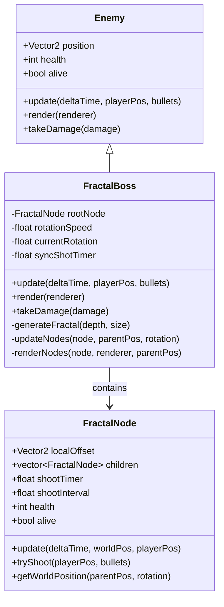

# План реализации: Фрактальный босс

## 🎯 Обзор

Создание нового типа босса состоящего из множества взаимосвязанных частей, расположенных в виде фрактальной структуры (квадратный фрактал). Каждая часть может стрелять независимо, а общая структура вращается и динамически изменяется при получении урона.

## 📋 Текущее состояние системы

### ✅ Уже реализовано
- Базовый класс `Enemy` с системой здоровья, движения и анимации
- Класс `BossEnemy` с продвинутым ИИ и стрельбой
- Система пуль с типом `BOSS_BULLET`
- Математические операции `Vector2` для позиционирования
- Система спавна боссов в `Game.cpp`

### ❌ Требует реализации
- Класс `FractalNode` для отдельных частей
- Класс `FractalBoss` как композитный босс
- Алгоритм генерации фрактальной структуры
- Система распределения урона по узлам
- Независимая стрельба каждого узла
- Динамическое изменение структуры при разрушении

## 🏗️ Архитектура решения

### Компонентная диаграмма
```mermaid
graph TD
    subgraph "FractalBoss System"
        FB[FractalBoss : Enemy]
        FB --> RN[rootNode : FractalNode]
        FB --> RS[rotationSpeed : float]
        FB --> ST[syncShotTimer : float]
        
        RN --> FN1[child[0] : FractalNode]
        RN --> FN2[child[1] : FractalNode]
        RN --> FN3[child[2] : FractalNode]
        RN --> FN4[child[3] : FractalNode]
        
        FN1 --> FN1_1[child[0]]
        FN1 --> FN1_2[child[1]]
        FN1 --> FN1_3[child[2]]
        FN1 --> FN1_4[child[3]]
    end
    
    subgraph "FractalNode Structure"
        FND[FractalNode]
        FND --> LO[localOffset : Vector2]
        FND --> CH[children : vector<FractalNode>]
        FND --> ST2[shootTimer : float]
        FND --> HP[health : int]
        FND --> AL[alive : bool]
    end
    
    subgraph "Game Integration"
        GM[Game]
        GM --> FS[FractalBoss spawn]
        FS --> BU[bullets : vector]
        FS --> RD[render calls]
        FS --> UP[update calls]
    end
```

### Иерархия классов


## 📝 Детальный план реализации

### Этап 1: Создание базовых классов (2-3 дня)

#### 1.1 Класс FractalNode
**Файл**: `src/FractalNode.h` и `src/FractalNode.cpp`

**Структура**:
```cpp
class FractalNode {
public:
    Vector2 localOffset;              // Смещение относительно родителя
    std::vector<FractalNode> children; // Дочерние узлы
    float shootTimer;                 // Таймер до следующего выстрела
    float shootInterval;              // Интервал между выстрелами (0.8-1.5 сек)
    int health;                       // Здоровье узла (100-300 HP)
    bool alive;                       // Состояние узла
    float nodeRadius;                 // Радиус узла для коллизий
    
    FractalNode(Vector2 offset = Vector2(0, 0), int hp = 200);
    
    void update(float deltaTime, Vector2 parentWorldPos, float rotation, Vector2 playerPos);
    void tryShoot(Vector2 playerPos, std::vector<std::unique_ptr<Bullet>>& bullets);
    Vector2 getWorldPosition(Vector2 parentPos, float rotation) const;
    void takeDamage(int damage);
    bool hasLivingChildren() const;
    int getTotalHealth() const;         // Суммарное здоровье узла и детей
    void render(SDL_Renderer* renderer, Vector2 worldPos) const;
};
```

**Ключевые методы**:
- `getWorldPosition()` - преобразование локальных координат в мировые с учетом поворота
- `tryShoot()` - независимая стрельба каждого узла
- `hasLivingChildren()` - проверка наличия живых дочерних узлов
- `getTotalHealth()` - подсчет общего здоровья ветки

#### 1.2 Математические функции для фрактала
**Файл**: `src/FractalUtils.h` и `src/FractalUtils.cpp`

```cpp
namespace FractalUtils {
    // Поворот точки относительно центра
    Vector2 rotatePoint(const Vector2& point, const Vector2& center, float angle);
    
    // Генерация позиций для квадратного фрактала
    std::vector<Vector2> generateSquarePositions(float size, int level);
    
    // Интерполяция между позициями для плавной анимации
    Vector2 lerp(const Vector2& a, const Vector2& b, float t);
}
```

### Этап 2: Основной класс FractalBoss (3-4 дня)

#### 2.1 Базовая структура FractalBoss
**Файл**: `src/FractalBoss.h` и `src/FractalBoss.cpp`

**Характеристики босса**:
```cpp
class FractalBoss : public Enemy {
private:
    FractalNode rootNode;           // Корневой узел фрактала
    float rotationSpeed;            // Скорость вращения (30-45 град/сек)
    float currentRotation;          // Текущий угол поворота
    float syncShotTimer;            // Таймер синхронизированных залпов
    float pulseTimer;              // Таймер пульсации структуры
    float pulseAmplitude;          // Амплитуда пульсации
    int fractalDepth;              // Глубина фрактала (2-3 уровня)
    float baseSize;                // Базовый размер структуры
    
public:
    FractalBoss(Vector2 pos, SDL_Renderer* renderer, int depth = 2);
    ~FractalBoss() override;
    
    void update(float deltaTime, Vector2 playerPos, std::vector<std::unique_ptr<Bullet>>& bullets) override;
    void render(SDL_Renderer* renderer) override;
    void takeDamage(int damage) override;
    int getMaxHealth() const override;
    
private:
    void generateFractal(FractalNode& node, int currentDepth, float size);
    void updateNodes(FractalNode& node, Vector2 parentPos, float rotation, float deltaTime, Vector2 playerPos, std::vector<std::unique_ptr<Bullet>>& bullets);
    void renderNodes(FractalNode& node, SDL_Renderer* renderer, Vector2 parentPos, float rotation);
    void performSyncShot(FractalNode& node, Vector2 playerPos, std::vector<std::unique_ptr<Bullet>>& bullets);
    FractalNode* findClosestNode(FractalNode& node, Vector2 hitPosition, Vector2 parentPos, float rotation);
};
```

#### 2.2 Алгоритм генерации фрактала

**Квадратный фрактал**:
```cpp
void FractalBoss::generateFractal(FractalNode& node, int currentDepth, float size) {
    if (currentDepth <= 0) return;
    
    // Создаем 4 дочерних узла в углах квадрата
    float offset = size / 2.0f;
    node.children.resize(4);
    
    // Позиции углов квадрата
    node.children[0].localOffset = Vector2(-offset, -offset); // Верх-лево
    node.children[1].localOffset = Vector2(offset, -offset);  // Верх-право
    node.children[2].localOffset = Vector2(-offset, offset);  // Низ-лево
    node.children[3].localOffset = Vector2(offset, offset);   // Низ-право
    
    // Инициализация характеристик узлов
    for (auto& child : node.children) {
        child.health = 150 - (currentDepth * 50); // Меньше здоровья на глубоких уровнях
        child.shootInterval = 1.0f + (currentDepth * 0.3f); // Медленнее стреляют глубокие узлы
        child.nodeRadius = 20.0f - (currentDepth * 5.0f);
        child.alive = true;
        
        // Рекурсивно создаем подструктуры
        generateFractal(child, currentDepth - 1, size * 0.6f);
    }
}
```

### Этап 3: Игровые механики (2-3 дня)

#### 3.1 Система стрельбы

**Типы стрельбы по узлам**:
- **Центральный узел**: Точные выстрелы в игрока каждые 0.8 сек
- **Узлы первого уровня**: Веерная стрельба (3 пули под углами) каждые 1.2 сек  
- **Узлы второго уровня**: Случайная стрельба каждые 1.5 сек

```cpp
void FractalNode::tryShoot(Vector2 playerPos, std::vector<std::unique_ptr<Bullet>>& bullets) {
    if (!alive || shootTimer < shootInterval) return;
    
    Vector2 worldPos = getWorldPosition(parentPos, rotation);
    Vector2 toPlayer = (playerPos - worldPos).normalized();
    
    if (children.empty()) {
        // Листовой узел - точная стрельба
        bullets.push_back(std::make_unique<Bullet>(
            worldPos, toPlayer, 8, 500.0f, 400.0f, BulletType::BOSS_BULLET, true
        ));
    } else {
        // Узел с детьми - веерная стрельба
        for (int i = -1; i <= 1; i++) {
            float angle = std::atan2(toPlayer.y, toPlayer.x) + (i * 0.3f);
            Vector2 direction(std::cos(angle), std::sin(angle));
            
            bullets.push_back(std::make_unique<Bullet>(
                worldPos, direction, 6, 400.0f, 350.0f, BulletType::BOSS_BULLET, true
            ));
        }
    }
    
    shootTimer = 0.0f;
}
```

#### 3.2 Система получения урона

**Умная система таргетинга**:
```cpp
void FractalBoss::takeDamage(int damage) {
    // Находим ближайший узел к точке попадания
    Vector2 hitPosition = /* позиция пули при попадании */;
    FractalNode* targetNode = findClosestNode(rootNode, hitPosition, position, currentRotation);
    
    if (targetNode && targetNode->alive) {
        targetNode->takeDamage(damage);
        
        // Если узел уничтожен, увеличиваем скорость стрельбы оставшихся
        if (!targetNode->alive) {
            boostSurvivingNodes();
        }
    }
    
    // Обновляем общее здоровье босса
    health = rootNode.getTotalHealth();
    if (health <= 0) {
        alive = false;
    }
}
```

#### 3.3 Динамическое поведение

**Адаптивные механики**:
```cpp
void FractalBoss::update(float deltaTime, Vector2 playerPos, std::vector<std::unique_ptr<Bullet>>& bullets) {
    // Постоянное вращение структуры
    currentRotation += rotationSpeed * deltaTime;
    
    // Пульсация размера (±10% каждые 3 секунды)
    pulseTimer += deltaTime;
    float pulseFactor = 1.0f + (pulseAmplitude * std::sin(pulseTimer));
    
    // Синхронизированные залпы каждые 5 секунд
    syncShotTimer += deltaTime;
    if (syncShotTimer >= 5.0f) {
        performSyncShot(rootNode, playerPos, bullets);
        syncShotTimer = 0.0f;
    }
    
    // Обновление всех узлов
    updateNodes(rootNode, position, currentRotation, deltaTime, playerPos, bullets);
    
    // Адаптация сложности при потере узлов
    adaptDifficulty();
}
```

### Этап 4: Интеграция с игрой (1-2 дня)

#### 4.1 Добавление в систему спавна

**Модификация Game.cpp**:
```cpp
// В enum для типов врагов
enum class EnemySpawnType {
    BASE,
    SLIME, 
    PEBBLIN,
    BOSS,
    FRACTAL_BOSS  // Новый тип
};

// В методе спавна
if (wave >= 5 && !fractalBossSpawned) {  // Спавн с 5-й волны
    Vector2 spawnPos(WINDOW_WIDTH/2, 150);
    currentFractalBoss = CreateFractalBoss(spawnPos, renderer);
    fractalBossSpawned = true;
}
```

#### 4.2 Factory функция

**FractalBoss.cpp**:
```cpp
std::unique_ptr<Enemy> CreateFractalBoss(const Vector2& pos, SDL_Renderer* renderer, int depth) {
    return std::make_unique<FractalBoss>(pos, renderer, depth);
}
```

### Этап 5: Визуализация и полировка (2-3 дня)

#### 5.1 Визуальные эффекты

**Рендеринг узлов**:
```cpp
void FractalNode::render(SDL_Renderer* renderer, Vector2 worldPos) const {
    if (!alive) return;
    
    // Основной узел - квадрат
    SDL_SetRenderDrawColor(renderer, 200, 100, 50, 255);
    SDL_Rect nodeRect = {
        (int)(worldPos.x - nodeRadius),
        (int)(worldPos.y - nodeRadius),
        (int)(nodeRadius * 2),
        (int)(nodeRadius * 2)
    };
    SDL_RenderFillRect(renderer, &nodeRect);
    
    // Контур узла
    SDL_SetRenderDrawColor(renderer, 255, 150, 100, 255);
    SDL_RenderDrawRect(renderer, &nodeRect);
    
    // Соединительные линии к дочерним узлам
    SDL_SetRenderDrawColor(renderer, 150, 75, 25, 255);
    for (const auto& child : children) {
        if (child.alive) {
            Vector2 childWorldPos = child.getWorldPosition(worldPos, 0);
            SDL_RenderDrawLine(renderer, 
                (int)worldPos.x, (int)worldPos.y,
                (int)childWorldPos.x, (int)childWorldPos.y);
        }
    }
}
```

#### 5.2 Анимации и эффекты

- **Пульсация узлов** при стрельбе
- **Эффект разрушения** с частицами
- **Изменение цвета** в зависимости от здоровья
- **Плавное исчезновение** уничтоженных узлов

### Этап 6: Балансировка и тестирование (1-2 дня)

#### 6.1 Характеристики босса

**Базовые параметры**:
```cpp
// Конфигурация FractalBoss
struct FractalBossConfig {
    int fractalDepth = 2;           // Глубина фрактала
    float baseSize = 200.0f;        // Размер структуры
    float rotationSpeed = 45.0f;    // Градусы в секунду
    int rootHealth = 2000;          // Здоровье центрального узла
    int nodeHealth = 150;           // Здоровье обычного узла
    float syncShotInterval = 5.0f;  // Интервал синхро-залпов
};
```

**Прогрессия по волнам**:
- **Волна 5**: Фрактал глубины 2, медленная стрельба
- **Волна 8**: Фрактал глубины 3, ускоренная стрельба
- **Волна 12**: Двойной фрактал (два одновременно)

#### 6.2 Тестовые сценарии

1. **Базовая функциональность**: Спавн, движение, стрельба
2. **Система урона**: Уничтожение отдельных узлов
3. **Адаптивность**: Изменение поведения при потере частей
4. **Производительность**: FPS при множественных узлах
5. **Балансировка**: Время убийства, сложность уклонения

## 📂 Структура файлов

### Новые файлы:
```
src/
├── FractalNode.h           // Базовый узел фрактала
├── FractalNode.cpp
├── FractalBoss.h           // Главный класс босса
├── FractalBoss.cpp  
├── FractalUtils.h          // Математические утилиты
└── FractalUtils.cpp

docs/
└── fractal_boss_implementation_plan.md  // Этот файл
```

### Модифицируемые файлы:
```
src/
├── Game.h                  // Добавление FractalBoss в систему спавна
├── Game.cpp                // Интеграция нового босса
└── Bullet.cpp              // Возможные новые типы пуль
```

## ⚡ Технические риски и решения

### Риск 1: Производительность
**Проблема**: Множество узлов могут снизить FPS
**Решение**: 
- Оптимизация рендеринга (batch rendering)
- Ограничение максимальной глубины (3 уровня)
- Использование object pooling для пуль

### Риск 2: Сложность коллизий
**Проблема**: Определение попадания в конкретный узел
**Решение**:
- Система AABB для каждого узла
- Поиск ближайшего узла по евклидову расстоянию
- Приоритет более крупных узлов при неоднозначности

### Риск 3: Балансировка
**Проблема**: Босс может быть слишком легким/сложным
**Решение**:
- Конфигурируемые параметры в отдельном файле
- A/B тестирование разных настроек
- Адаптивная сложность в зависимости от прогресса игрока

## 🎯 Критерии готовности

### MVP (Минимальный продукт):
- ✅ Фрактальная структура из 2 уровней
- ✅ Независимая стрельба каждого узла
- ✅ Вращение структуры
- ✅ Система получения урона по узлам
- ✅ Базовая интеграция в игру

### Полная функциональность:
- ✅ Настраиваемая глубина фрактала (2-3 уровня)
- ✅ Адаптивное поведение при разрушении
- ✅ Синхронизированные залпы
- ✅ Визуальные эффекты и анимации
- ✅ Прогрессия сложности по волнам
- ✅ Оптимизированная производительность

## 📅 Временные рамки

**Общее время разработки: 9-13 дней**

### Фаза 1 (3-4 дня): Основа
- Создание `FractalNode` и `FractalBoss`
- Базовая генерация фрактала
- Простая стрельба и движение

### Фаза 2 (3-4 дня): Механики  
- Система получения урона
- Адаптивное поведение
- Интеграция с игрой

### Фаза 3 (2-3 дня): Полировка
- Визуальные эффекты
- Балансировка
- Оптимизация

### Фаза 4 (1-2 дня): Тестирование
- Отладка багов
- Финальная балансировка
- Документация

## 🚀 Возможные расширения

### После MVP:
1. **Различные фрактальные паттерны**: Треугольник, шестиугольник, спираль
2. **Специальные способности**: Телепортация, щиты, ускорение
3. **Многофазные бои**: Изменение структуры в процессе боя
4. **Кооперативные фракталы**: Несколько фракталов взаимодействующих друг с другом

## 🎮 Игровой опыт

Фрактальный босс создаст уникальный игровой опыт:
- **Стратегический выбор**: Какие узлы атаковать первыми
- **Динамический вызов**: Босс становится непредсказуемее при разрушении
- **Визуальная привлекательность**: Красивая геометрическая структура
- **Прогрессия сложности**: От простого к сложному по мере изучения паттернов

Этот босс станет изюминкой игры и покажет инновационный подход к дизайну противников в жанре bullet hell / survival shooter. 